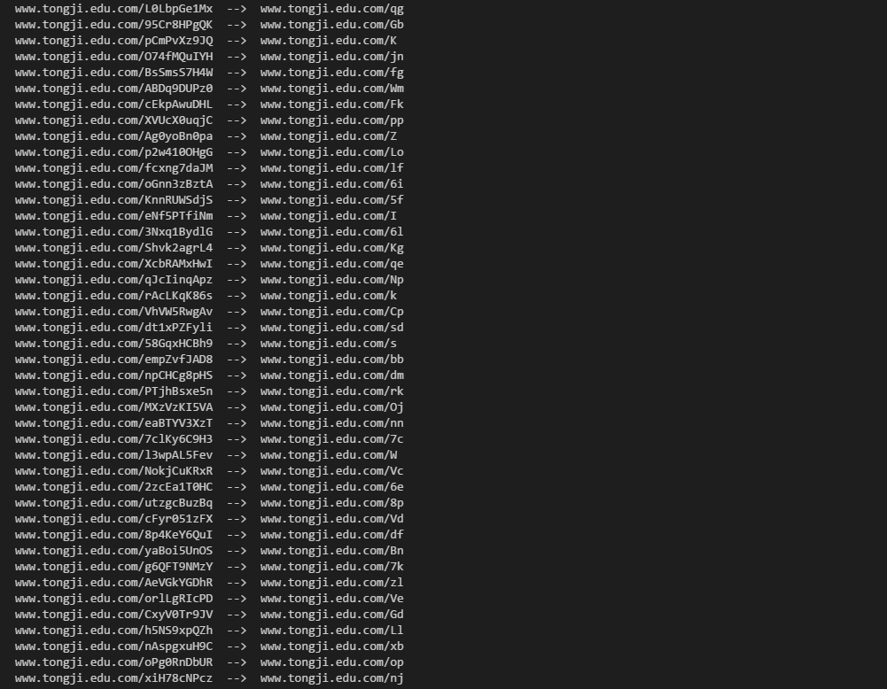

## url长链接转短链接

### 短址本质：
短址本质上是实现了一个映射函数 f: X -> Y 。而这个映射函数必须同时具有两个特点：
1. 如果 x1 != x2, 则 f (x1) != f(x2);
2. 对于每一个 y, 能够找到唯一的一个 x 使得 f(x) = y;
对于任何的线性函数，比如 f(x) = 2x，都满足这样的条件。


### 思路

1. 建立一个 key-value 对，表示长链接到短链接的对应关系。

2. 假设，这个对应关系是F，利用长链接的**序号**取建立这个对应关系。


#### 如何建立对应关系F ? 

短址的长度一般设为 6 位，而每一位是由 [a - z, A - Z, 0 - 9] 总共 62 个字母组成的，所以6位的话，总共会有 62^6 ~= 568亿种组合，基本上够用了。在google URL shortener 服务中，短址长度为 5，大概有9亿多种组合.


需要转换的长地址的url的格式，可能如下：
```
id      长地址
000      xxxx
001      xxxx
002      xxxx
003      xxxx
004      xxxx
.         .
.         .
```

可能利用它的id，将id 映射到 短地址的空间里面。短地址的每一位的空间是[a-z,A-Z,0-9]

```
000  ---> aaaaaa
001  ---> aaaaab
002  ---> aaaaac
 .   --->  ..
 .   --->  ..
```

也就是将10进制转换成62进制。10进制-->k进制的方法是，除k取余。


#### 效果

