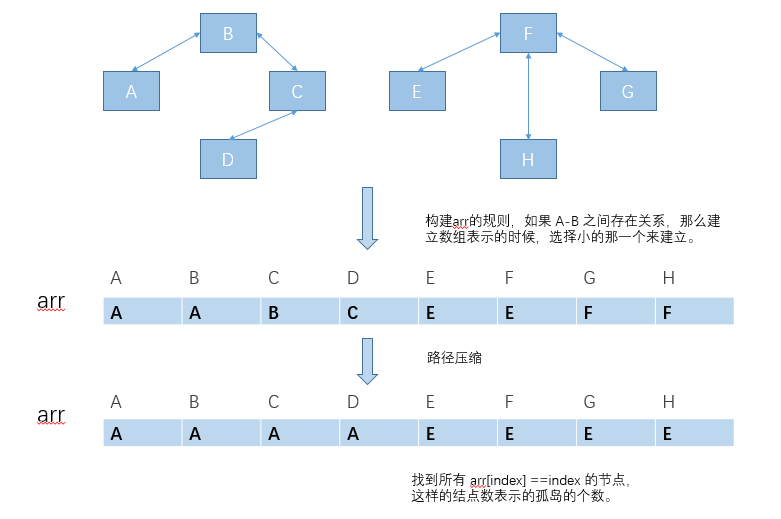

## 并查集

并查集是是一个很“精妙”的数据结构，对于一些特定的问题，并查集可以很巧妙的解决。

比如，http://acm.hdu.edu.cn/showproblem.php?pid=1232 

在比如，给出一推好友之间的关系，比如 a-b ，c-d，b-d ... ，问，这里面有几个独立的朋友圈？

拿一个具体的例子讨论一下：

我的blog ： https://www.jianshu.com/p/c150dfba1ca1